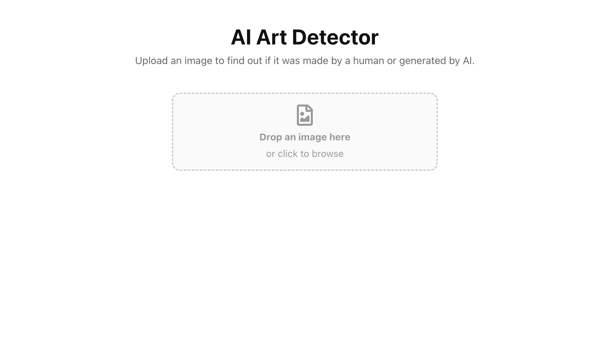
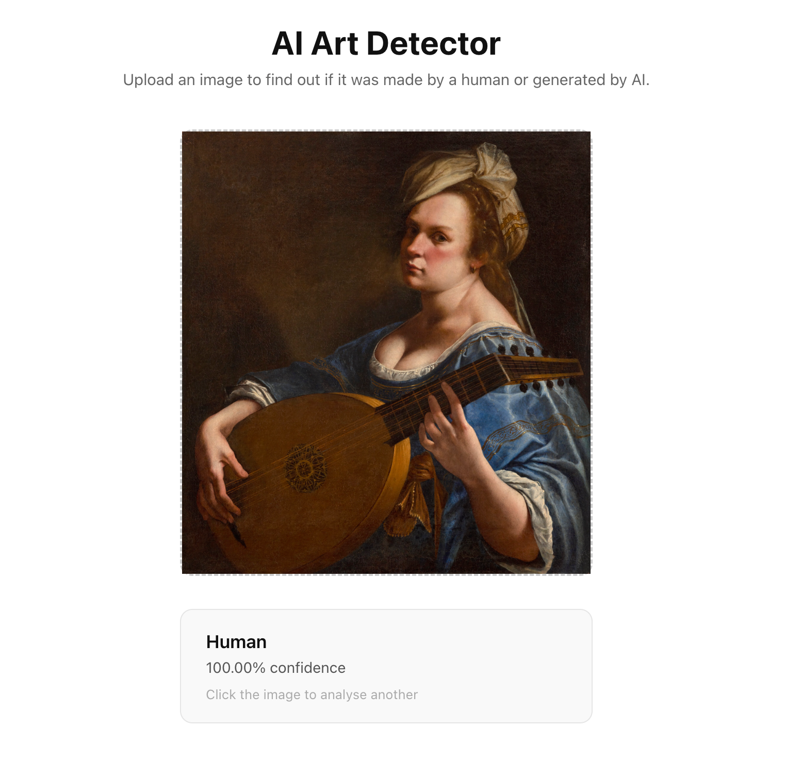
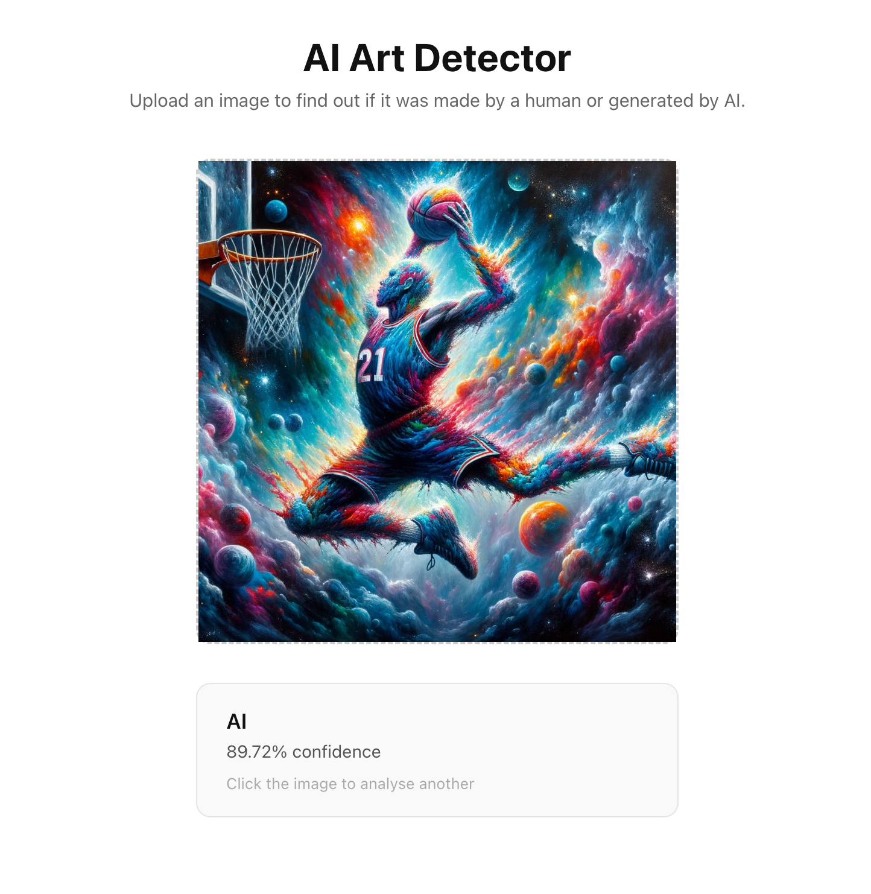
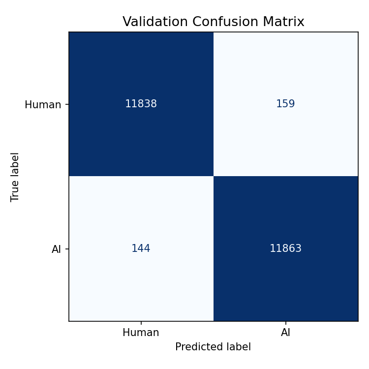
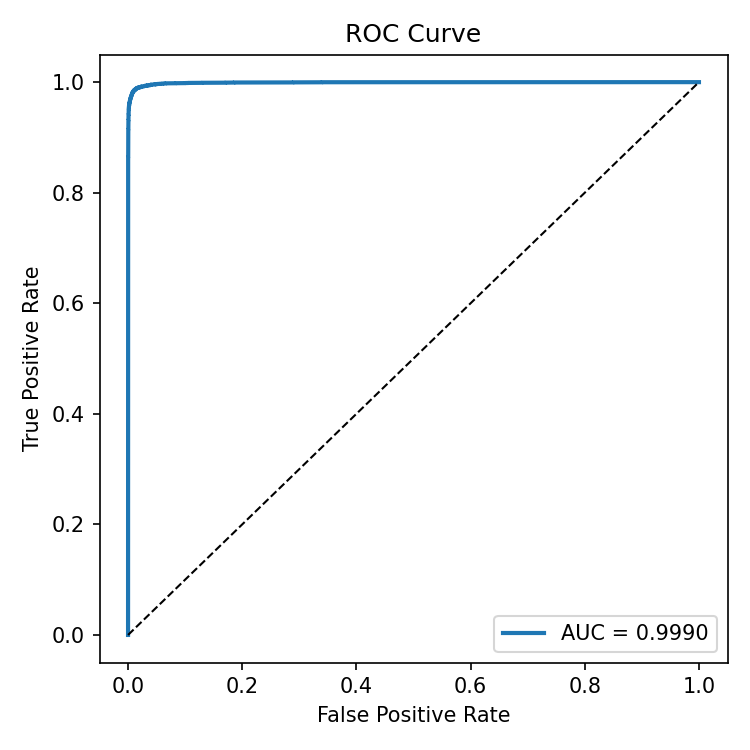

# AI Art Detector

A full-stack web app that classifies images of artworks as AI-generated or human-made which deploys a fine-tuned ResNet18 model. Upload an image for real-time prediction with a confidence score.

**[Live Demo](https://ai-art-detector-psi.vercel.app)**

---

## Screenshots



| Human result | AI result |
|---|---|
|  |  |

---

## How it works

Images are passed through a fine-tuned ResNet18 convolutional neural network for binary classification. The model outputs a probability score, which is thresholded to produce a Human / AI label alongside a confidence percentage.

The frontend sends the image to a Flask REST API, which runs inference and returns a JSON result. The model file is hosted on Hugging Face Hub and downloaded at server startup.

---

## Tech stack

**Machine learning**
- PyTorch - model training and inference
- ResNet18 - pretrained CNN fine-tuned and customized for binary classification
- torchvision - image transforms and augmentation


**Backend**
- Python / Flask - REST API
- Gunicorn - WSGI server
- Hugging Face Spaces - hosting (Docker)
- Hugging Face Hub - model file storage

**Frontend**
- Next.js (TypeScript) - UI and API routing
- Vercel - hosting and deployment

---

## Model

The classifier is a ResNet18 with its final fully-connected layer replaced with a single-output linear layer, trained with binary cross-entropy loss. The model was trained on a labeled dataset of AI-generated and human-made images with data augmentation (random flips, color jitter, normalization).

The best checkpoint is selected based on validation accuracy and stored on Hugging Face Hub. At inference time the model runs on CPU.

---
 
## Model performance
 
| Confusion matrix | ROC curve |
|---|---|
|  |  |

---


## Project structure
The repo is a monorepo with a `frontend/` Next.js app and a `backend/` Flask API. Model training code lives in `src/`. The backend is deployed separately to Hugging Face Spaces via its own git remote.

---

## Running locally

**Backend**

```bash
cd backend
pip install -r requirements.txt
python app.py
```

The API runs at `http://localhost:5001`.

**Frontend**

```bash
cd frontend
npm install
npm run dev
```

The app runs at `http://localhost:3000`.

---

## API

`POST /api/predict`

Accepts a `multipart/form-data` request with an `image` field (JPEG, PNG, WebP, or BMP, max 10MB).

**Response**
```json
{
  "label": "Human",
  "confidence": 0.9312,
  "prob_ai": 0.0688
}
```

---

## Deployment
Vercel - Next.js frontend  
Hugging Face Spaces - Flask backend (Docker)  
Hugging Face Hub - Best model checkpoint storage  

The backend is containerized with Docker and deployed as a Hugging Face Space. The model is downloaded from Hugging Face Hub at startup and cached in `/tmp` for the lifetime of the container.
